# Gemini CLI 安装与使用避坑指南

作者：KKKK


本文档记录了在 Windows 环境下安装 Gemini CLI、解决网络连接超时 (`ETIMEDOUT`) 以及使用 Gemini 3 Pro 的完整流程。

---

## 第一步：安装 Node.js


### 第一种：没有下载过Node

前往 Node.js 官网下载安装包（https://nodejs.org/en/download）

注意**：请务必选择 **Node.js 20** 或更高版本，并且**选择LTS版本**

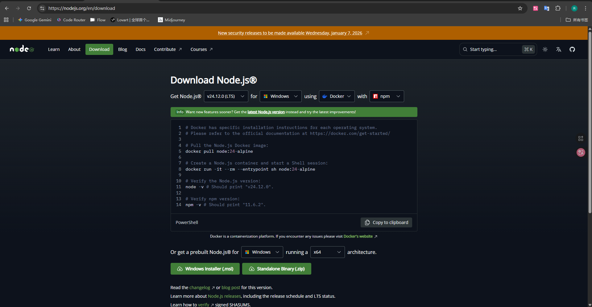


### 第二种：使用NVM进行Node的版本控制

使用NVM进行Node的版本控制:[Releases · coreybutler/nvm-windows](https://github.com/coreybutler/nvm-windows/releases)


安装后输入以下命令

```
nvm -v
```

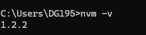


```
nvm list available
```


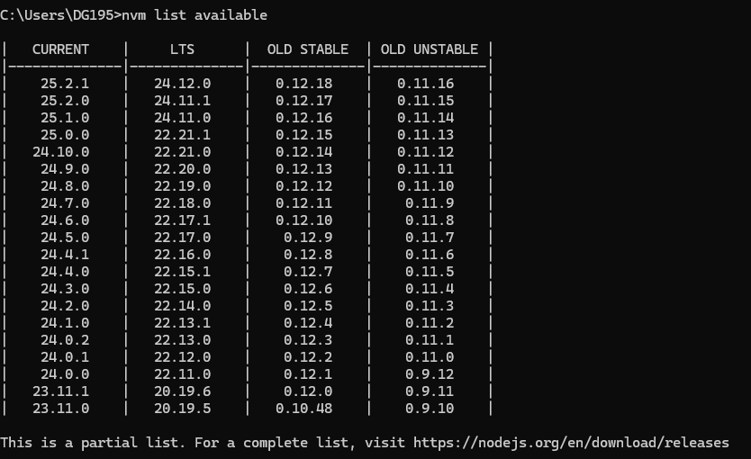


**1.安装指定版本**

选择LTS的版本

```
nvm install 24.12.0
```


**2.输入检查当前版本**

```
node -v
```


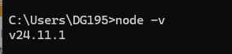

**3.查看已安装的所有Node,js版本**

```
nvm list
```

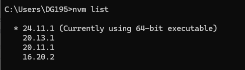


**4.使用nvm use切换Node版本**

```
nvm use node版本号
```


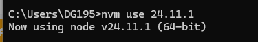


## 第二步：安装 Gemini CLI


### 1.访问官网：[https://geminicli.com/](https://geminicli.com/)


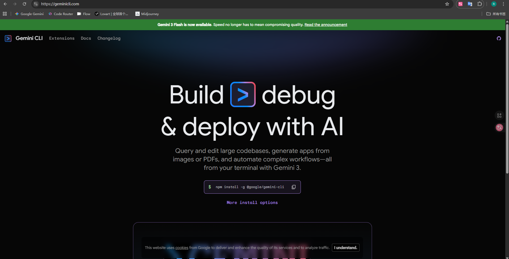


### 2. 执行安装命令

在终端（PowerShell）中输入：

```powershell
npm install -g @google/gemini-cli
```


### 3.查看当前版本


输入：

```
gemini --version
```

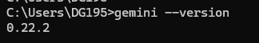


## 第三步：进行登录

输入：

```
gemini
```

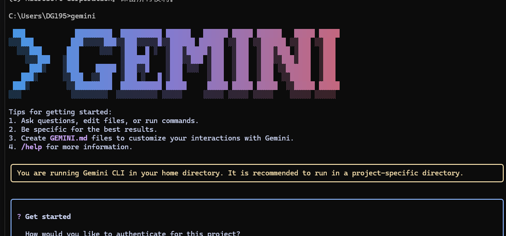


#### 选择一：谷歌账号验证：

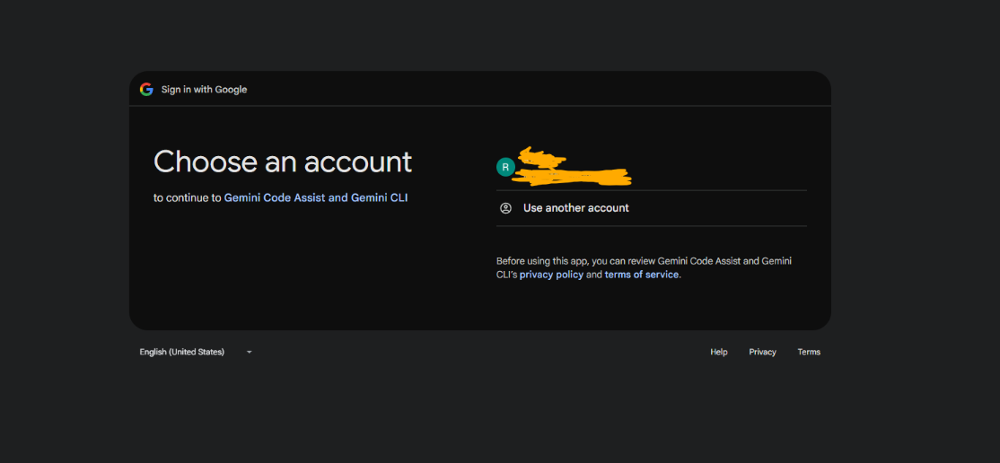


选择自己的谷歌账号即可


##### **登录失败**：（成功的跳过这一节）

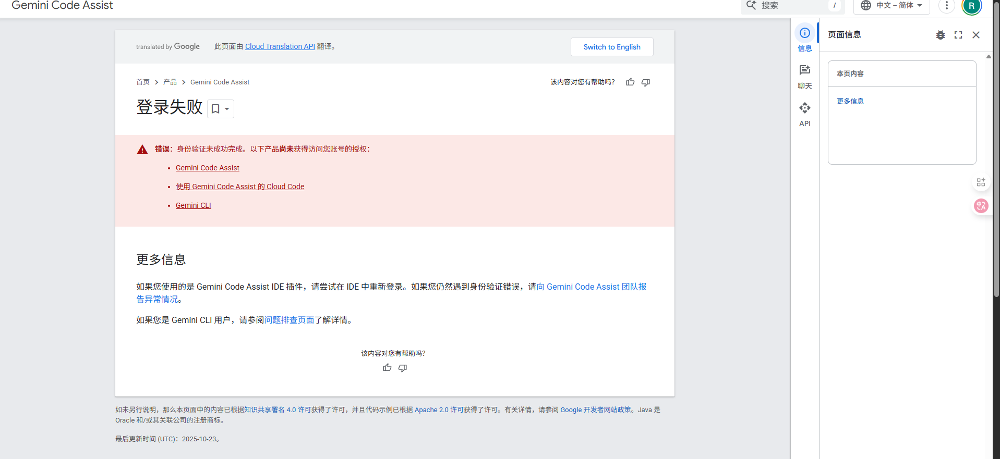


###### 步骤一：关闭旧窗口

​	请务必**关闭**当前已经打开的所有终端/PowerShell 窗口，重新打开一个新的。这能确保之前的配置不干扰。

###### 步骤二：执行“完美代理”命令

​	请在新的 PowerShell 窗口中，**一次性复制并运行**下面这三行命令。*(防止代理软件拦截本地回调)*


```
$env:HTTP_PROXY="http://127.0.0.1:7890"
$env:HTTPS_PROXY="http://127.0.0.1:7890"
$env:NO_PROXY="localhost,127.0.0.1"
```


7890端口号根据自己的修改


###### **步骤三：代理软件打开“Mixin" (混合配置) 或 "System Proxy" (系统代理）**


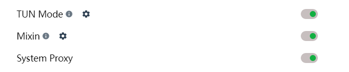


###### 步骤四：重新验证

​	

```
gemini
```


验证成功

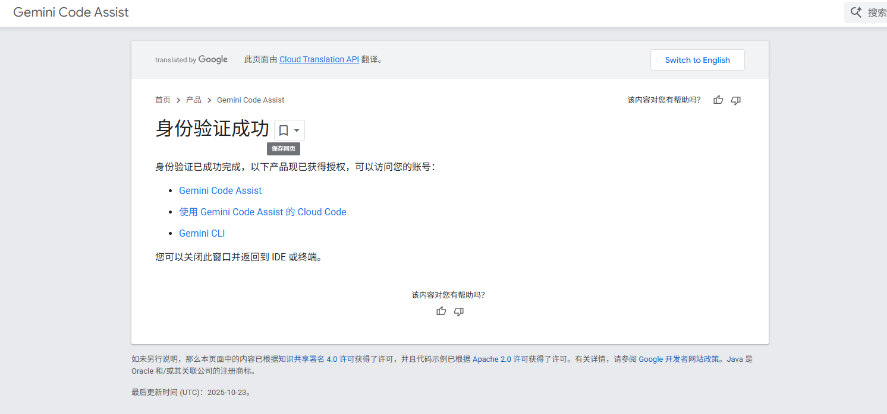


#### 选择二：API登录


##### 第一步：清除旧的 API Key (强制登出)

Gemini CLI 通常把登录信息保存在你电脑的一个文件里。我们需要删除它来触发“重新登录”


在PowerShell中输入：

```
Remove-Item $env:USERPROFILE\.gemini* -Force -ErrorAction SilentlyContinue
```


##### 第二步：前往申请一个key（https://aistudio.google.com/app/api-keys）

https://aistudio.google.com/app/api-keys

申请之后复制key


第三步：在登录页面选择2

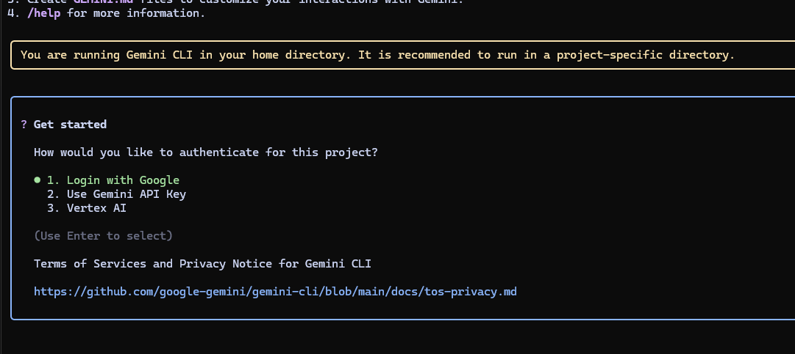

之后输入key即可登录


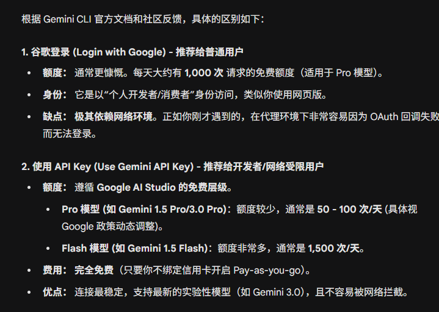


## 第四步：完成安装


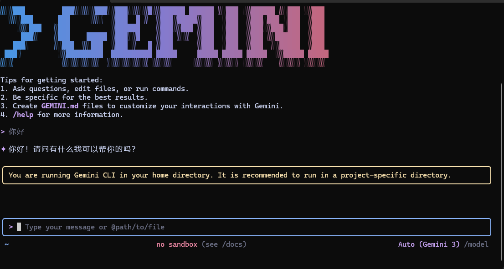


## 设置Gemini3


输入：

```
/settings
```


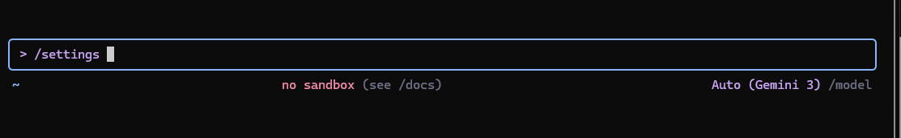


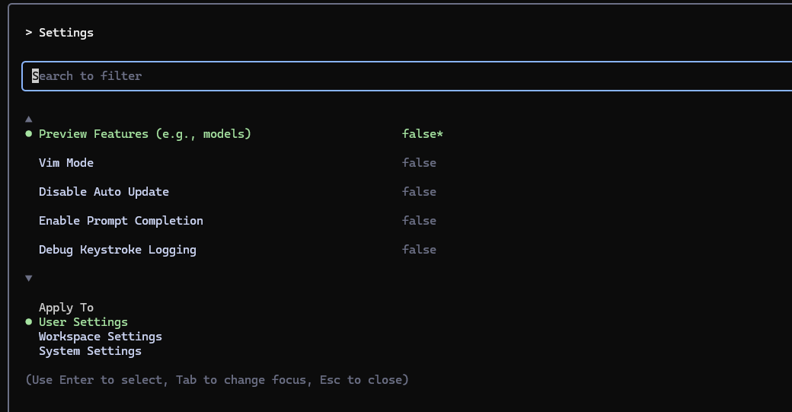


打开第一个`Preview Features`

回车就行


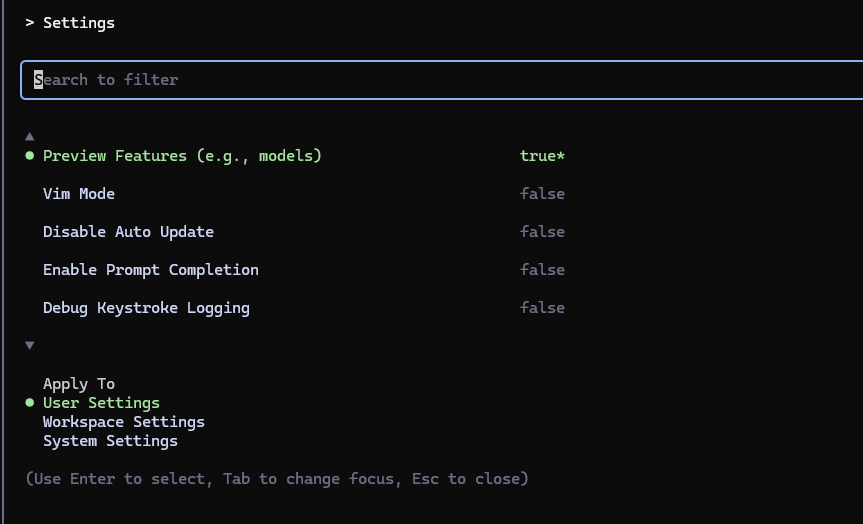


打开后ESC


输入

```
/model
```

 选择模式


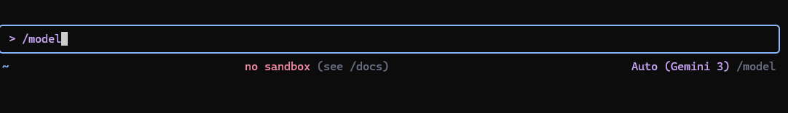

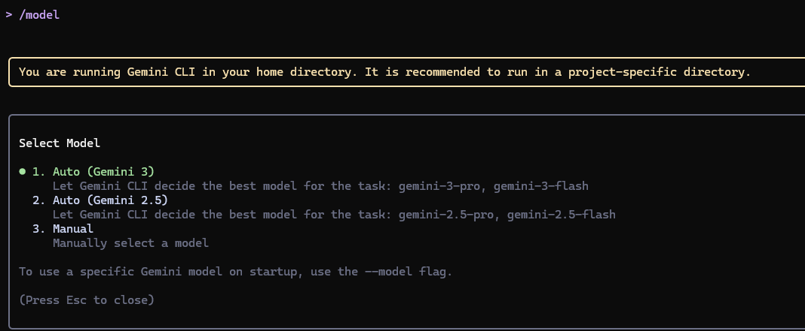


选择自己需要的模式


